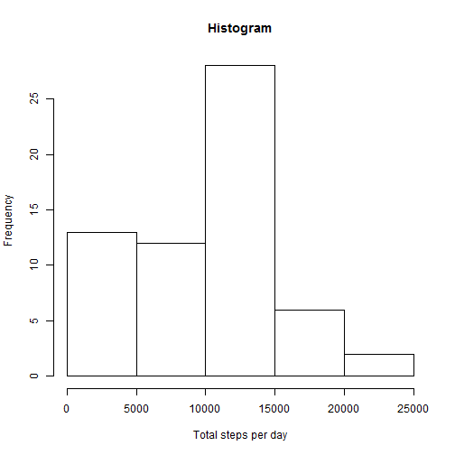
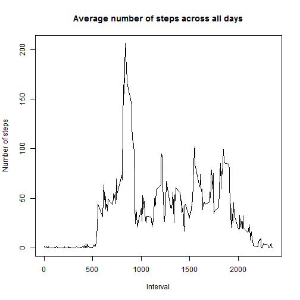
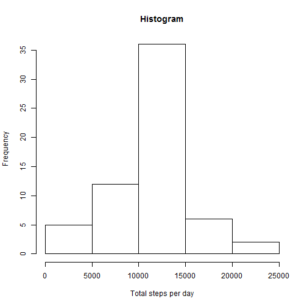
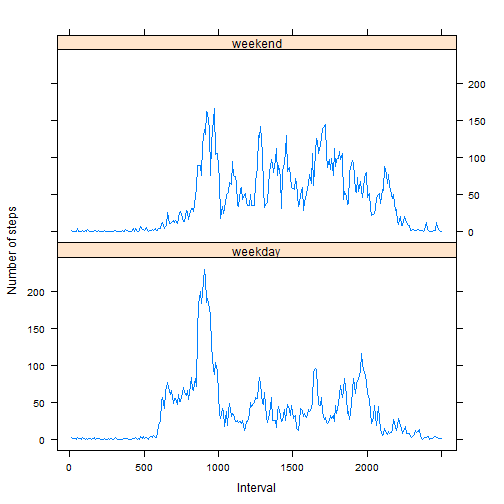

# Reproducible Research: Peer Assessment 1


## Loading and preprocessing the data

```r
### 1.Load the data. NOTE: Download the activity.zip from github repo and unzip 
### it to obtain activity.csv before running this code.
library(knitr)
data <- read.csv("activity.csv")
```

## What is mean total number of steps taken per day?

```r
### 1. Make a histogram of the toal number of steps taken each day
totalStepsPerDay <- tapply(data$steps, data$date, sum, na.rm = TRUE)
hist(totalStepsPerDay, xlab="Total steps per day", main="Histogram")
```

 

```r
### 2. Calculate and report the mean and median total number of steps taken per day
totalStepsPerDayMean <- mean(totalStepsPerDay, na.rm = TRUE)
totalStepsPerDayMedian <- median(totalStepsPerDay, na.rm = TRUE)
```
The mean and median total number of steps per day are 9354.2295 
and 10395.

## What is the average daily activity pattern?
For this part of the assignment, the missing values in the dataset are ignored.

```r
### 1. Make a time series plot of the 5-minite interval (x-axis) and the average
### number of steps taken, averaged across all days (y-axis)
avesteps <- tapply(data$steps, data$interval, mean, na.rm = TRUE)
plot(avesteps, x = rownames(avesteps), type="l", xlab = "Interval", 
     ylab = "Number of steps", main = "Average number of steps across all days")
```

 

```r
### 2. Which 5-minute interval, on average across all the days in the dataset, 
### contains the maximum number of steps?
maxInterval <- names(avesteps)[which.max(avesteps)]
```
The 5-minute interval "835" on average across all the days in the dataset, contains
the maximum number of steps.

## Imputing missing values

```r
### 1. Calculate and report the total number of missing values in the dataset 
### (i.e. the total number of rows with NAs)
bad <- is.na(data)
totalNAs <- nrow(data[bad, ])
```
The total number of missing values in the dataset is 2304.


```r
### 2. Devise a strategy for filling in all of the missing values in the dataset. 
### The mean for that 5-minute interval is used to fill the missing values.
df <- as.data.frame(avesteps, row.names=NULL)
df$interval <- names(avesteps)
```
The mean for 5-minute interval has been obtained as "avesteps" in the above step,
which is transformed to a data frame "df".

```r
### 3. Create a new dataset that is equal to the original dataset but with 
### missing data filled in.
newdata <- data
for (i in df$interval) {
        newdata[(newdata$interval==i & bad), ][1] <- df[df$interval==i, ][1]
}
```
The new dataset "newdata" equals to the original dataset but with missing data
filled in by that 5-minute interval.


```r
### 4. Make a histogram of the total number of steps taken each day and Calculate 
### and report the mean and median total number of steps taken per day. Do these 
### values differ from the estimates from the first part of the assignment? What
### is the impact of imputing missing data on the estimates of the total daily 
### number of steps?
totalStepsPerDayNew <- tapply(newdata$steps, newdata$date, sum, na.rm = TRUE)
hist(totalStepsPerDayNew, xlab="Total steps per day", main="Histogram")
```

 

```r
totalStepsPerDayMeanNew <- mean(totalStepsPerDayNew, na.rm = TRUE)
totalStepsPerDayMedianNew <- median(totalStepsPerDayNew, na.rm = TRUE)
```
The mean and median total number of steps per day are 1.0766 &times; 10<sup>4</sup> 
and 1.0766 &times; 10<sup>4</sup>.
These values differ from the estimates from the first part of the assignment.
Imputing missing data increases the estimates of the total daily number of steps.

## Are there differences in activity patterns between weekdays and weekends?
The dataset "newdata" with the fill-in missing values is used for this part.

```r
### 1. Create a new factor variable in the dataset with two levels - "weekday" 
### and "weekend" indicating whether a given date is a weekday or weekend day.
day <- factor(weekdays(as.Date(newdata$date)) %in% c("Saturday", "Sunday"))
day <- gsub("TRUE","weekend",day)
day <- gsub("FALSE","weekday",day)
newdata$day <- day
```
The new factor variable "day" in "newdata" with two levels - "weekday" and "weekend"
is created.


```r
### 2. Make a panel plot containing a time series plot (i.e. type = "l") of the 
### 5-minute interval (x-axis) and the average number of steps taken, averaged 
### across all weekday days or weekend days (y-axis).
newdataWeekdays <- newdata[newdata$day=="weekday", ] ### Subset newdata based on weekdays
newdataWeekends <- newdata[newdata$day=="weekend", ] ### Subset newdata based on weekends
### Averge steps of 5-minute interval across weekdays and weekends
weekday <- tapply(newdataWeekdays$steps, newdataWeekdays$interval, 
                           mean, na.rm = TRUE)
weekend <- tapply(newdataWeekends$steps, newdataWeekends$interval, 
                           mean, na.rm = TRUE)
### Combine into one data frame
avestepsWeekdaysWeekends <- rbind(weekday, weekend)
avestepsDataframe <- as.data.frame(as.table(avestepsWeekdaysWeekends))
names(avestepsDataframe) <- c("day", "interval", "averagesteps")
### Make the panel plot using lattice
library(lattice)
avestepsDataframe <- transform(avestepsDataframe, day = factor(day))
ticknumber <- 6
at <- seq(0,length(levels(avestepsDataframe$interval)),length.out=ticknumber)
labels <- c(0, 500, 1000, 1500, 2000, "")
xyplot(averagesteps ~ interval | day, data=avestepsDataframe, layout=c(1,2), 
     type="l", xlab = "Interval", ylab = "Number of steps", xlim=c(-10,300),
     scales=list(x=list(at=at, labels=labels)))
```

 
